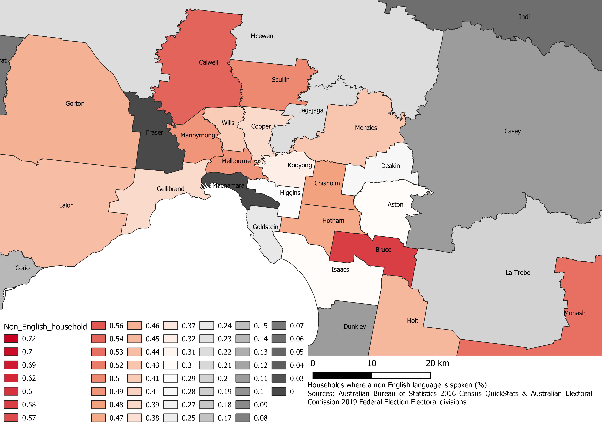

# Data Analysis Portfolio 

## 1. Census data mapping (QGIS)

### Most multicultural federal electorates in Australia   

The map shows the percentage of  households where a non English language is spoken in Australia.

#### NSW


#### VIC



#### SA


#### WA


#### Reference

* [Australian Bureau of Statistics 2016, _2016 Census QuickStats_, viewed 5 August 2019.](https://quickstats.censusdata.abs.gov.au/census_services/getproduct/census/2016/quickstat/CED137?opendocument#cultural)

- [Australian Electoral Commission 2019, _Federal electoral boundaries_, viewed 5 August 2019.](<https://www.aec.gov.au/Electorates/gis/index.htm>)

_It is a voluntary work for Democracy in Colour._

## 2. Remote Sensing analysis (Python)

### Case of Eucalyptus camaldulensis in Riverland Ramsar Wetland, South Australia

#### Study Location


#### Data and Methods 

Data pre-processing, analyses and visualization were performed using Python3.7 and ArcGIS 10.5.1. Three types of data are used including optical satellite observed indices, predicted environmental data, and ground-based observations.

Satellite imagery and indices 

Three individual dates of Geoscience Australia (2016)’s Landsat 8 imagery Surface reflectance Nadir Bidirectional reflectance distribution function Adjusted Reflectance and  the terrain illumination reflectance correction (NBART) (10 Sep 2015, 28 Sep 2016 and 15 Sep 2017) were used in this research (Geoscience Australia, 2017a).  NDVI and NDII were derived from the Geoscience Australia (2016)’s NBART products. SWIR-1 was used for the NDII calculation. 

Predicted environmental meta-data

Soil moisture and bare soil fraction data were acquired from the Australia’s Environmental Explorer. 

Field-based tree occurrence records 

148 individual River red gum tree records with latitude and longitude coordinates reported between 1983 and 2016 retrieved from The Altas of Living Australia were used for extracting the value of indices. Nearest-neighbour interpolation was used to extract value. 

#### Result

**Figure 1** NDVI, NDII, Soil Moisture and Bare Soil Fraction values (2015-2017)


**Figure 2** Pearson’s correlation analysis

| NDVI and NDII                                                | NDVI and soil moisture                                       | NDVI and bare soil fraction                                  |
| ------------------------------------------------------------ | ------------------------------------------------------------ | ------------------------------------------------------------ |
|  |  |  |

**Table 1** Ordinary Least Squares (OLS) Regression result


#### Python libraries 

```python
from glob import glob
import xarray as xr
import numpy as np
import pandas as pd      
import xarray as xr
import scipy.io
from netCDF4 import Dataset
from osgeo import gdal, gdal_array
from pyproj import Proj, transform 
from skimage import exposure
import matplotlib.pyplot as plt
import seaborn
import datetime
import datacube
from scipy.ndimage import zoom as ndzoom
%matplotlib inline
seaborn.set_style("dark")
```

_It is an independent research project (coursework) supervised by Prof. Albert Van Dijk in Advanced Remote Sensing and GIS (ENVS6319) in 2018._

## 3. Land use suitability assessment (ArcGIS)

### A Small Cluster Residential Development Proposal in Kowen


#### Flowchart


_It is a coursework assignment conducted in GIS and Spatial Analysis (ENVS6015) in 2017._

[Statistical Analysis](./stat.md)

