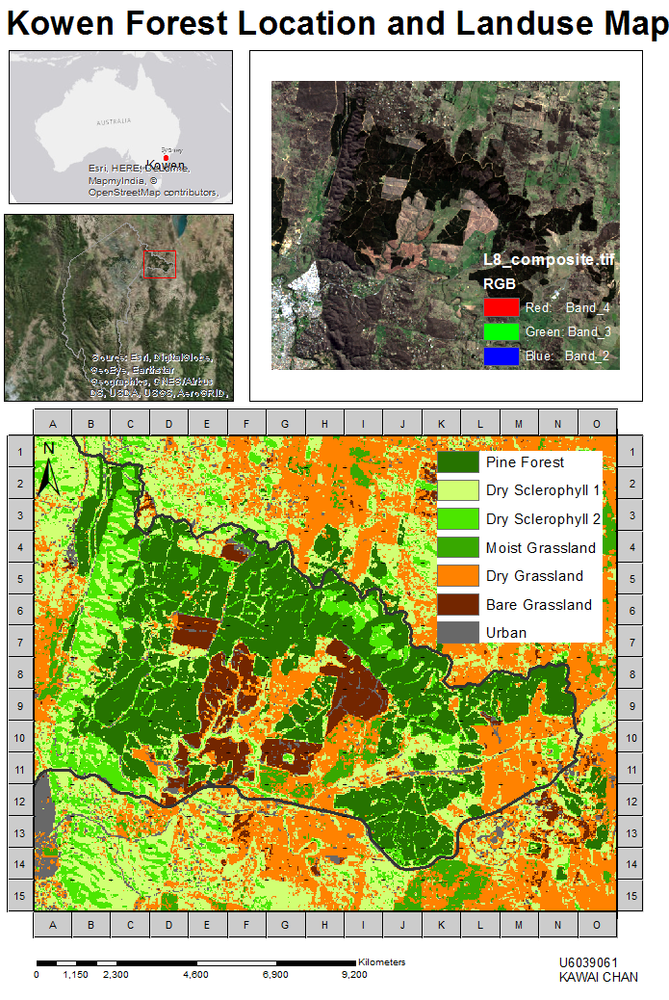
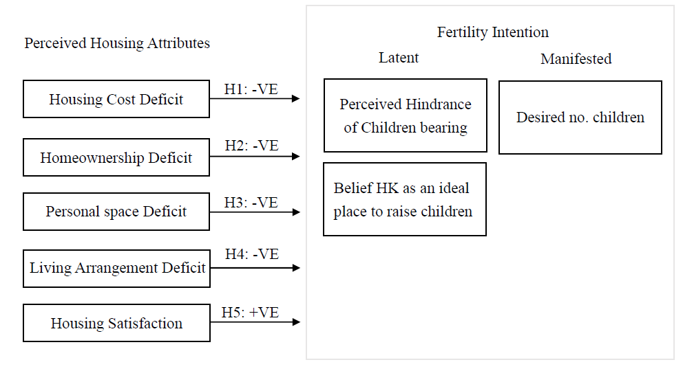

# Data Analysis Portfolio 

## 1. Remote Sensing analysis (Python)

### Case of Eucalyptus camaldulensis in Riverland Ramsar wetland, South Australia

#### Data and Methods 

Data pre-processing, analyses and visualization were performed using Python3.7 and ArcGIS 10.5.1. Three types of data are used including optical satellite observed indices, predicted environmental data, and ground-based observations.

Satellite imagery and indices 

Three individual dates of Geoscience Australia (2016)’s Landsat 8 imagery Surface reflectance Nadir Bidirectional reflectance distribution function Adjusted Reflectance and  the terrain illumination reflectance correction (NBART) (10 Sep 2015, 28 Sep 2016 and 15 Sep 2017) were used in this research (Geoscience Australia, 2017a). Due to the impact of cloud cover and fixed return interval of the Landsat 8 sensor, the closest possible dates before and after the 2016 natural flooding event with cloud-free imageries are chosen (Ozesmi & Bauer, 2002). Surface reflectance NBAR+T 25 v. 2, a suite of  Geoscience Australia (2016)’s Earth Observation product that provides standardised optical surface reflectance datasets with corrected atmospheric, topographic and Bidirectional Reflectance Distribution Function (BRDF) effects (Lewis et al., 2017). As Surface reflectance NBAR+T 25 v. 2 was launched in 2016, Surface Reflectance NBAR+ was used for Landsat data correction between 1987 and 2015 (Geoscience Australia, 2017b). NDVI and NDII were derived from the Geoscience Australia (2016)’s NBART products. SWIR-1 was used for the NDII calculation. 

Predicted environmental meta-data

Soil moisture and bare soil fraction data were acquired from the Australia’s Environmental Explorer. Soil moisture refers to “average amount of water stored in the soil profile during the year as estimated by the OzWALD model-data fusion system” (Australia's Environment Explorer, 2018). Bare soil fraction refers to “annual mean percentage of soil that is unprotected by living vegetation or litter as mapped from MODIS satellite imager following the methodology of  Guerschman and colleagues (CSIRO)” (Australia's Environment Explorer, 2018). 

Field-based tree occurrence records 

148 individual River red gum tree records with latitude and longitude coordinates reported between 1983 and 2016 retrieved from (The Altas of Living Australia, n.d.) were used for extracting the value of indices. Nearest-neighbour interpolation was used to extract value. These field records were represented by 15,812 pixels in each year of the analysis.

Method 
Descriptive, correlation analysis and regression analysis were conducted to examine the relationship between NDVI, NDII, soil moisture and bare soil fraction. Response variable was NDVI. NDII, soil moisture and bare soil fraction were independent variables. Image classification based on threshold values of NDVI and NDII of study site was performed. 

#### Study Location


#### Result

**Figure 1 ** NDVI, NDII, Soil Moisture (mm) and Bare Soil Fraction (%) values (2015-2017)


**Figure 2 ** Pearson’s correlation analysis

| NDVI and NDII                                                | NDVI and soil moisture                                       | NDVI and bare soil fraction                                  |
| ------------------------------------------------------------ | ------------------------------------------------------------ | ------------------------------------------------------------ |
|  |  |  |

**Table 1** Ordinary Least Squares (OLS) Regression result


#### Python libraries 

```python
from glob import glob
import xarray as xr
import numpy as np
import pandas as pd      
import xarray as xr
import scipy.io
from netCDF4 import Dataset
from osgeo import gdal, gdal_array
from pyproj import Proj, transform 
from skimage import exposure
import matplotlib.pyplot as plt
import seaborn
import datetime
import datacube
from scipy.ndimage import zoom as ndzoom
%matplotlib inline
seaborn.set_style("dark")
```

_It is an independent research project (coursework) supervised by Prof. Albert Van Dijk in Advanced Remote Sensing and GIS (ENVS6319) in 2018._

## 2. Land use suitability assessment (ArcGIS)

### A Small Cluster Residential Development Proposal in Kowen

#### **Supervised Land use Classification**




#### Flowchart


## 3. Quantitative research (STATA)

### Do real GDP per capita, and CO2 emissions from manufacturing industries and construction predict energy consumption per capita?

#### **Data sources** 

The data from the World Bank’s World Development Index 2013 was utilized for this cross-sectional analysis. This study examines the relationship between impact of GDP on Energy consumption on a subset of 153 out of 231 cities and countries from seven regions. Cases with missing data are omitted in regression analysis, therefore, 78 regions and countries are excluded.  It is noted that aggregated data and countries with no data available are omitted from the total 264 observations in the dataset. Nauru and Kosovo are the two countries without available data.

#### **Result**


#### **STATA script**

``` 
use "./World development index\All_countries_WDIS_2013.dta", clear
drop if region=="Aggregates"
drop if region==""
g log_EnergyUse=log(eg_use_elec_kh_pc)
g log_RealGDP=log(ny_gdp_pcap_pp_kd)
sum eg_use_elec_kh_pc ny_gdp_pcap_pp_kd, detail
sum log_EnergyUse log_RealGDP en_co2_manf_zs, detail
encode region, g(regionnum) lab(regionlab)
regress log_EnergyUse log_RealGDP 
regress log_EnergyUse log_RealGDP en_co2_manf_zs  
by region, sort : regress log_EnergyUse log_RealGDP en_co2_manf_zs  
ssc install estout, replace
est clear 
eststo: quietly reg log_EnergyUse log_RealGDP
eststo: quietly reg log_EnergyUse log_RealGDP en_co2_manf_zs  
esttab, p scalars(F df_m df_r) r2 ar2
```

_It is a research project (coursework) tutored by Crawford School PhD scholar Chi-hoong Leong in Research Methods for Environmental Management (EMDV8102) in 2017._

## 4. Quantitative research (SPSS)

### Perceived Housing Correlates of Fertility Intention among Hong Kong people aged between 18 and 35
#### **Theoretical Framework**



#### Methodology

Before data for this report were gathered from January to February 2016, a pilot test
with 20 respondents was conducted in early November 2015. It helped to modify the
questionnaire design and enhance reliability of data retrieved. The questionnaires were
distributed to a total of 225 Hong Kong citizens aged between18 and 35 years old. The
response rate was 80 % (198 questionnaires).

- Sampling Method
  Non-probability sampling, quota sampling was adopted. The ratio of four items were
  controlled according to the official population data including sex, age, employment, and marital status.
- Instrument Designs
  There are two sets of questionnaires, one is for parents (Part A) and one is for nonparents
  (Part B). Part A contains 7 sections with 52 questions and Part B are composed of 50 questions. All questions are written in Traditional Chinese. Translations work for borrowing scales and questions from foreign researches were first completed by a researcher and passed to a group of five researchers for further modifications.

#### Data Processing and Data Analysis

After screening out suspect questionnaires with straight line answers, 172 questionnaires were counted as valid and used for data analysis. Valid questionnaires were firstly coded by a researcher, then double checked by another research. The data entry process was completed by a third research with SPSS 22.0. All variables had less than two missing values before replacing missing value with series means. Three level of analysis were made. Descriptive analysis was used for all variables. For categorical data, independent T-test was used for comparing the mean difference of independent variable with two groups, and ANOVA was used for variables with three or above groups. For continuous variables, bivariate analysis was used for comparing the correlation between two variables. Independent variables which found significant correlations with dependent variables were selected to do regression analysis. Categorical variables were recoded as dummy variables and entered the regression model (Table 1-3). All predictors in regression models passed the Collinearity test (Variance inflation factor <10) (Tables 8-1, 8-2 & 8-3). As there were three outcome variables of fertility intention, separate analysis was employed. There were three sets of regression model completed.

#### **Result**


_It is a honour research project supervised by Dr. Bai Xue at the Hong Kong Polytechnic University in 2015._